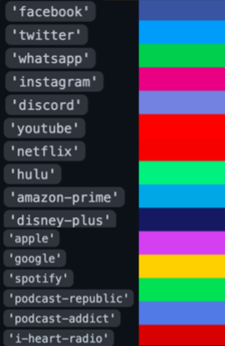

# What is this?

Get the colors of popular media platforms instead of having to find hex codes.

# Installation 

`npm i media-hex --save`

## React Example

One can put their styles in an object in one's React component file; however, replace the CSS property value with the mediaHexHelper.

```
import React from 'react';

import { mediaHexHelper } from 'media-hex';


const mediaColor = {
    color: mediaHexHelper('apple')
}

function MyComponent() {
    return (
        <div style={mediaColor}>This text will be Apple's purple</div>
    );
}

export default MyComponent;

```

**Social Media Hexes**
`'facebook'`
`'twitter'`
`'whatsapp'`
`'instagram'`
`'discord'`

**Video Streaming Media Hexes**
`'youtube'`
`'netflix'`
`'hulu'`
`'amazon-prime'`
`'disney-plus'`


**Audio Media Hexes**
`'apple'`
`'google'`
`'spotify'`
`'podcast-republic'`
`'podcast-addict'`
`'i-heart-radio'`

-  `'colors visualized'`


